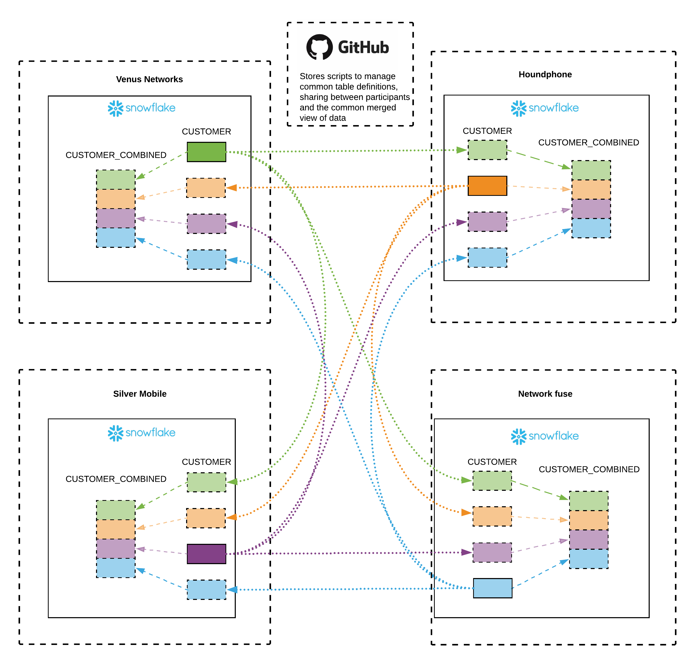

# snowflake-data-consortium
This repository serves as a pattern for managing a peer to peer data sharing consortium within [Snowflake](www.snowflake.net).

In this scenario, several parties all hold their own portion of the same dataset, that could potentially be combined into a shared view.

Additionally, there may be other parties who may need to view the dataset without having their own to contribute.

## Goals

There are many ways this could be approached, so an appropriate balance between the following goals is sought.

### Minimise collective administrative effort
As new participants join, each existing participant should not be required to make changes to their own account.

### Standardise source table definition
It would be preferable if participants did not have to each define their own table definition and then have them align centrally. Ideally each table could be defined once as part of the sharing agreement.

### Standardise combined view definition
Provide a way to define a dataset union centrally, so that participants don’t need to have a view on their end.

### No unauthorised exposure
Participants should not have their data exposed to parties without direct or delegated approval. Similarly, they should not have data from unauthorised parties including in the combined dataset.

## Implementation

A git repository (Github in this example) is used to store all of the table and view definitions, and the share management scripts.

In order to minimise the footprint of any automated deployment tools, it is desirable to have a plain SQL script so that specific runtimes (Python etc) are not required at each site.

The following scripts are used (these could be combined into one):

### [1_initial_configuration.sql](1_initial_configuration.sql)
This script creates a database that is used to store objects related to sharing, and the share itself.

### [2_sync_table_definitions.sql](2_sync_table_definitions.sql)
This script is designed to be re-ran whenever a new table is to be shared.

It creates the table, and wraps a view around it that includes the snowflake account id as an extra first column. This view is added to the share.

### [3_sync_membership.sql](3_sync_membership.sql)
This script is designed to be re-ran whenever a consortium member joins or leaves.

It creates a table to track membership, and a great big stored procedure to map inbound shares to databases and build a combined view out of them.

## Diagram



## Opportunities for improvement

Currently, if a consortium member violently revoked access to their shares, it would break the combined view for every other member:
```SQL compilation error: Shared database is no longer available for use. It will need to be re-created if and when the publisher makes it available again.```


